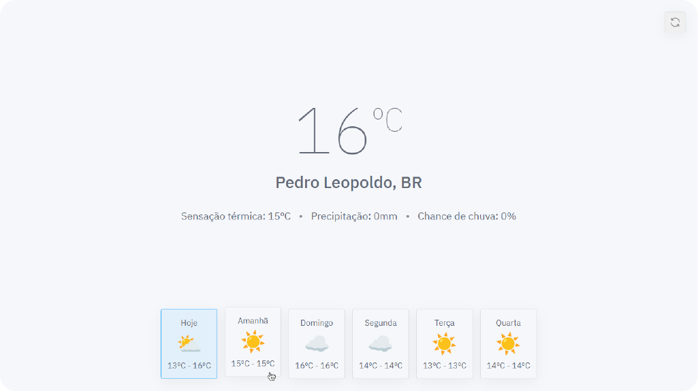

<h1 align="center">Doce Weather 🌦</h1>

<p align="center">
  Minimalist weather app based on your geolocation, consuming the <a href="https://openweathermap.org">OpenWeatherMap</a> API, made with Next.js & React and it's <a href="https://weather.doceazedo.com"><b>available here</b></a>.
</p>

<p align="center">
  <a href="https://weather.doceazedo.com">
    
  </a>
</p>

# Instructions

After cloning this repository, install the dependencies with:

```sh
yarn
```

Then start the development server:

```sh
yarn dev
```

The components documentation are available on Storybook:

```sh
yarn storybook
```
